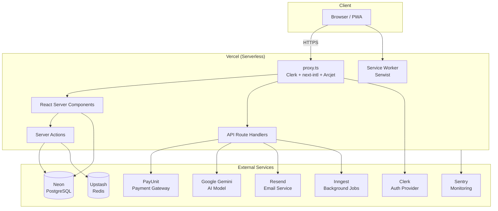
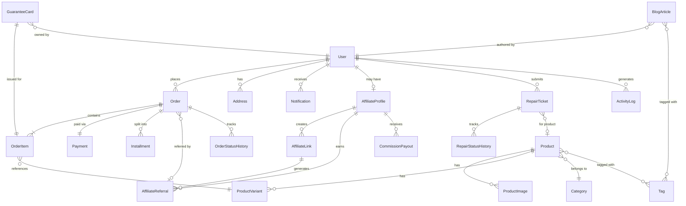
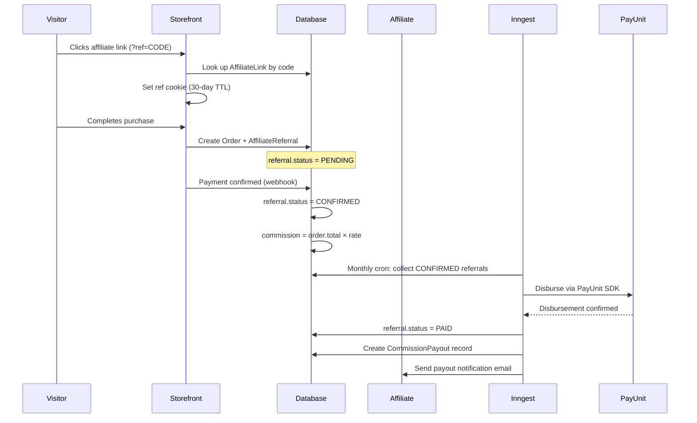
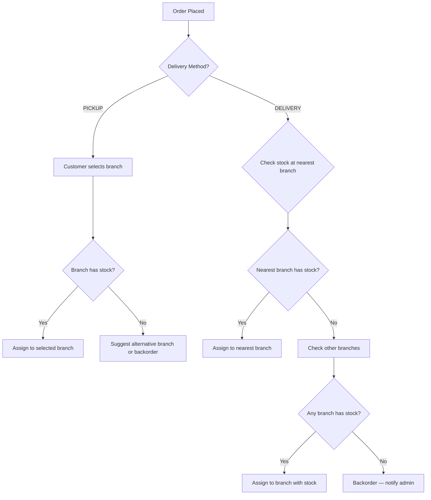

# Tei Store — Implementation Blueprint

| Field | Value |
|---|---|
| **Project** | Tei Store — Online extension of The Eye Informatique |
| **Version** | 0.1 |
| **Status** | Draft |
| **Date** | 2026-03-07 |
| **Companion** | [tei-store-srs.md](tei-store-srs.md) v0.2 |

---

## Table of Contents

1. [Document Control](#1-document-control)
2. [Introduction](#2-introduction)
3. [Tech Stack Summary](#3-tech-stack-summary)
4. [Architecture Overview](#4-architecture-overview)
5. [Project Structure](#5-project-structure)
6. [Data Model](#6-data-model)
7. [Authentication & Authorization](#7-authentication--authorization)
8. [Proxy Pipeline (Next.js 16)](#8-proxy-pipeline-nextjs-16)
9. [Payment Integration (PayUnit SDK)](#9-payment-integration-payunit-sdk)
10. [AI Integration (Vercel AI SDK + Gemini)](#10-ai-integration-vercel-ai-sdk--gemini)
11. [Affiliate System](#11-affiliate-system)
12. [Background Jobs & Cron (Inngest)](#12-background-jobs--cron-inngest)
13. [Internationalization (next-intl)](#13-internationalization-next-intl)
14. [Progressive Web App (Serwist)](#14-progressive-web-app-serwist)
15. [Email System (Resend + React Email)](#15-email-system-resend--react-email)
16. [Security Layer (Arcjet)](#16-security-layer-arcjet)
17. [State Management (Zustand)](#17-state-management-zustand)
18. [UI & Theming](#18-ui--theming)
19. [Monitoring & Error Tracking (Sentry)](#19-monitoring--error-tracking-sentry)
20. [Cross-Branch Fulfillment Logic](#20-cross-branch-fulfillment-logic)
21. [Testing Strategy](#21-testing-strategy)
22. [Deployment & CI/CD](#22-deployment--cicd)

---

## 1. Document Control

### 1.1 Version History

| Version | Date | Summary |
|---|---|---|
| 0.1 | 2026-03-07 | Initial blueprint — full architecture, integrations, data model, project structure |

### 1.2 Relationship to SRS

This document describes **how** Tei Store is built. The SRS (v0.2) describes **what** Tei Store does.

| Concern | Document |
|---|---|
| Functional requirements, acceptance criteria, user stories | `tei-store-srs.md` |
| Architecture, tech stack, integration patterns, data model, project structure | This document |

Implementation details referenced here (library names, API shapes, directory paths) are intentionally absent from the SRS. The two documents are maintained independently but cross-referenced by module and story IDs.

---

## 2. Introduction

### 2.1 Purpose

This blueprint provides the architectural foundation for implementing Tei Store. It covers technology choices, project structure, data modelling, integration patterns for every external service, and operational concerns (testing, deployment, monitoring). Code snippets are pseudocode showing integration patterns — not production-ready implementations.

### 2.2 Scope

This document covers all 11 SRS modules (M1–M11), 8 non-functional requirements (NFR-1 through NFR-8), and 6 Cameroon operational constraints (CON-1 through CON-6). Every library in `package.json` is mapped to its purpose and the SRS modules it serves.

### 2.3 Conventions

- **Snippets** are TypeScript pseudocode illustrating integration patterns. They may omit error handling or edge cases for clarity.
- **File paths** use `@/` to reference the project root (mapped via `tsconfig.json` path alias `"@/*": "./*"`).
- **SRS references** use the format `M[module].[story]` (e.g., M3.2) and `AC-M[module].[story]-[number]` (e.g., AC-M3.2-5).

---

## 3. Tech Stack Summary

### 3.1 Dependency Table

| Library | Version | Purpose | SRS Module(s) |
|---|---|---|---|
| `next` | 16.1.6 | App Router framework, SSR, API routes, server actions | All |
| `react` / `react-dom` | 19.2.3 | UI rendering | All |
| `@clerk/nextjs` | ^7.0.1 | Authentication (social sign-in, email+password, session management) | M1.1, M1.2, M9.2 |
| `@prisma/client` / `@prisma/adapter-pg` | ^7.4.2 | ORM for PostgreSQL (Neon serverless) | All data modules |
| `ai` / `@ai-sdk/google` / `@ai-sdk/react` | ^6.0.116 / ^3.0.43 / ^3.0.118 | AI SDK with Gemini 3 Flash Preview integration | M11.1–M11.5 |
| `@payunit/nodejs-sdk` | TBD | Payment gateway SDK (collections, checkout, invoices, disbursements) | M3.2, M5.6, M9.1, CON-1, CON-3 |
| `inngest` | ^3.52.6 | Background jobs, cron scheduling, step functions | M5.6, M7.3, CON-3 |
| `@arcjet/next` | ^1.2.0 | Bot detection, rate limiting, email validation, injection protection | M9.2 |
| `@sentry/nextjs` | ^10.42.0 | Error tracking, performance monitoring | NFR-4 |
| `resend` / `@react-email/components` | ^6.9.3 / ^1.0.8 | Transactional email sending + React-based templates | M7.1 |
| `next-intl` | ^4.8.3 | i18n routing, translation management | NFR-3, CON-2 |
| `next-themes` | ^0.4.6 | Theme switching (dark/light/system) | NFR-8 |
| `serwist` / `@serwist/turbopack` | ^9.5.6 | PWA service worker, offline caching | M10.1 |
| `zustand` | ^5.0.11 | Client-side state management (cart, UI state) | M3.2 |
| `zod` | ^4.3.6 | Schema validation (forms, API input, AI structured output) | M9.2, M11.1 |
| `react-hook-form` / `@hookform/resolvers` | ^7.71.2 / ^5.2.2 | Form state management with Zod resolver | All form modules |
| `@blocknote/core` / `@blocknote/react` / `@blocknote/shadcn` | ^0.47.1 | Rich text editor for blog articles and content | M6.1 |
| `@upstash/redis` | ^1.36.3 | Serverless Redis for caching and rate limiting | NFR-1, M9.2 |
| `axios` | ^1.13.6 | HTTP client for external service calls | M9.1 |
| `recharts` | 2.15.4 | Analytics dashboard charts | M8.1 |
| `shadcn` | ^3.8.5 (dev) | UI component generator (54 components installed) | All UI modules |
| `radix-ui` | ^1.4.3 | Accessible UI primitives underlying shadcn | All UI modules |
| `@base-ui/react` | ^1.2.0 | Additional UI primitives | All UI modules |
| `sonner` | ^2.0.7 | Toast notifications | M7.1 |
| `vaul` | ^1.1.2 | Drawer component (mobile navigation) | All UI modules |
| `cmdk` | ^1.1.1 | Command palette (admin search) | M1.2 |
| `lucide-react` | ^0.577.0 | Icon library | All UI modules |
| `date-fns` | ^4.1.0 | Date formatting (DD/MM/YYYY per CON-2.2) | CON-2 |
| `react-day-picker` | ^9.14.0 | Date picker component | M8.1, CON-3 |
| `embla-carousel-react` | ^8.6.0 | Product image carousel | M2.1, M3.1 |
| `react-resizable-panels` | ^4.7.1 | Resizable dashboard panels | M1.2 |
| `class-variance-authority` / `clsx` / `tailwind-merge` | ^0.7.1 / ^2.1.1 / ^3.5.0 | CSS utility helpers for shadcn | All UI modules |
| `dotenv` | ^17.3.1 | Environment variable loading | All |
| `jest` | ^30.2.0 (dev) | Unit and integration testing | NFR (testing) |
| `@playwright/test` | ^1.58.2 (dev) | End-to-end browser testing | NFR (testing) |
| `prisma` | ^7.4.2 (dev) | Schema management, migrations CLI | All data modules |
| `typescript` | ^5 (dev) | Type safety | All |
| `tailwindcss` / `@tailwindcss/postcss` / `tw-animate-css` | ^4 / ^4 / ^1.4.0 (dev) | Utility-first CSS framework with animations | All UI modules |
| `eslint` / `eslint-config-next` | ^9 / 16.1.6 (dev) | Code linting | All |
| `esbuild` | ^0.27.3 (dev) | Fast bundling for dev tooling | All |

### 3.2 Technology Justifications

| Choice | Rationale |
|---|---|
| **PayUnit** (`@payunit/nodejs-sdk`) | Selected over alternatives (e.g., Tranzak) for its well-documented Node.js SDK with TypeScript support, superior dashboard interface, and built-in e-commerce features — checkout sessions with item arrays, installment invoices with scheduled payments, and disbursements for affiliate payouts. These map directly to M3.2 (checkout), CON-3 (installments), and M5.6 (commission payouts). |
| **Inngest** | Step-function–based background job system that runs on Vercel serverless without dedicated infrastructure. Provides cron scheduling, retries, and event-driven workflows — required for M7.3 (activity log cleanup), M5.6 (monthly commission payouts), and CON-3 (installment deadline monitoring). |
| **Arcjet** | Single SDK combining bot detection, email validation, rate limiting, and injection protection. Replaces the need for separate CAPTCHA, rate-limiter, and WAF solutions. Directly satisfies M9.2 (platform security controls). |
| **BlockNote.js** | Rich text editor with a native `@blocknote/shadcn` adapter, providing consistent UI with the rest of the application. Used for M6.1 (blog article authoring) where staff need a WYSIWYG editing experience. |
| **Upstash Redis** | Serverless Redis compatible with Vercel's edge and serverless runtimes. Used for caching (NFR-1 performance), session data, and rate-limit counters without managing a persistent Redis instance. |
| **Neon (PostgreSQL)** | Serverless PostgreSQL with connection pooling via `@prisma/adapter-pg`. Automatic scaling, branching for preview deployments, and zero cold-start latency. |

---

## 4. Architecture Overview

### 4.1 System Diagram



### 4.2 Runtime Boundaries

| Runtime | Runs On | Used By |
|---|---|---|
| **Edge** | Vercel Edge Network | `proxy.ts` (Clerk middleware, next-intl locale detection, Arcjet protection) |
| **Node.js (Serverless)** | Vercel Serverless Functions | API route handlers (`app/api/`), server actions (`actions/`), Inngest functions |
| **Client** | User's Browser | React client components, Zustand stores, `useChat`, BlockNote editor, service worker |

### 4.3 Deployment Topology

```
┌─────────────────────────────────────────────────────┐
│                    Vercel Platform                   │
│  ┌──────────┐  ┌──────────────┐  ┌───────────────┐  │
│  │   Edge   │  │  Serverless  │  │    Static     │  │
│  │ proxy.ts │  │  Functions   │  │    Assets     │  │
│  │          │  │  (API/Actions)│  │  (public/)    │  │
│  └──────────┘  └──────────────┘  └───────────────┘  │
└─────────────────┬──────────────────┬────────────────┘
                  │                  │
      ┌───────────┴──┐     ┌────────┴────────┐
      │  Neon         │     │  Upstash Redis  │
      │  PostgreSQL   │     │  (Serverless)   │
      │  (Serverless) │     └─────────────────┘
      └──────────────┘
```

### 4.4 Request Flow

1. **Browser** sends HTTPS request to Vercel
2. **Edge runtime** executes `proxy.ts`: Clerk authenticates the session → next-intl resolves the locale → Arcjet applies rate limiting and bot detection
3. **Serverless runtime** renders RSC or executes the matched route handler / server action
4. **Data layer** queries Neon (via Prisma) or Upstash Redis (for cached data)
5. **External calls** to PayUnit, Gemini, Resend, or Inngest occur within serverless functions — never from the client
6. **Response** streams back through the Edge to the browser

---

## 5. Project Structure

```
the-eye-informatique/
├── app/                          # Next.js App Router
│   ├── [locale]/                 # next-intl locale segment
│   │   ├── (storefront)/        # Public-facing pages
│   │   │   ├── page.tsx          # Homepage
│   │   │   ├── products/
│   │   │   │   ├── page.tsx      # Product listing       (M2.1)
│   │   │   │   └── [slug]/
│   │   │   │       └── page.tsx  # Product detail         (M2.1)
│   │   │   ├── cart/
│   │   │   │   └── page.tsx      # Cart view              (M3.1)
│   │   │   ├── checkout/
│   │   │   │   └── page.tsx      # Checkout flow          (M3.2)
│   │   │   ├── blog/
│   │   │   │   ├── page.tsx      # Blog listing           (M6.1)
│   │   │   │   └── [slug]/
│   │   │   │       └── page.tsx  # Blog article           (M6.1)
│   │   │   ├── guarantee/
│   │   │   │   └── page.tsx      # Guarantee lookup       (M4.1)
│   │   │   └── layout.tsx        # Storefront shell (nav, footer)
│   │   │
│   │   ├── (dashboard)/
│   │   │   ├── (admin)/          # Admin panel
│   │   │   │   ├── layout.tsx    # Admin sidebar + header
│   │   │   │   ├── page.tsx      # Dashboard overview     (M8.1)
│   │   │   │   ├── products/
│   │   │   │   │   ├── page.tsx  # Product management     (M2.2)
│   │   │   │   │   └── [id]/
│   │   │   │   │       └── page.tsx  # Product editor     (M2.2)
│   │   │   │   ├── orders/
│   │   │   │   │   ├── page.tsx  # Order management       (M3.3)
│   │   │   │   │   └── [id]/
│   │   │   │   │       └── page.tsx  # Order detail       (M3.3)
│   │   │   │   ├── repairs/
│   │   │   │   │   ├── page.tsx  # Repair queue           (M4.1)
│   │   │   │   │   └── [id]/
│   │   │   │   │       └── page.tsx  # Repair ticket      (M4.1)
│   │   │   │   ├── affiliates/
│   │   │   │   │   └── page.tsx  # Affiliate management   (M5.5)
│   │   │   │   ├── blog/
│   │   │   │   │   ├── page.tsx  # Blog management        (M6.1)
│   │   │   │   │   └── [id]/
│   │   │   │   │       └── page.tsx  # Blog editor        (M6.1)
│   │   │   │   ├── analytics/
│   │   │   │   │   └── page.tsx  # Analytics dashboard    (M8.1)
│   │   │   │   └── settings/
│   │   │   │       └── page.tsx  # Platform settings      (M1.2)
│   │   │   │
│   │   │   ├── (central-admin)/  # Central Admin dashboard (R6 only)
│   │   │   │   ├── layout.tsx    # Central admin shell
│   │   │   │   ├── page.tsx      # Cross-branch overview   (M8.1)
│   │   │   │   ├── branches/
│   │   │   │   │   └── page.tsx  # Branch management       (CON-5)
│   │   │   │   ├── users/
│   │   │   │   │   └── page.tsx  # System-wide user mgmt   (M1.2)
│   │   │   │   ├── broadcasts/
│   │   │   │   │   └── page.tsx  # System-wide broadcasts  (M7.1)
│   │   │   │   ├── knowledge-base/
│   │   │   │   │   └── page.tsx  # AI knowledge base docs  (M11)
│   │   │   │   ├── analytics/
│   │   │   │   │   └── page.tsx  # Consolidated analytics  (M8.1)
│   │   │   │   └── activity-log/
│   │   │   │       └── page.tsx  # Platform activity log   (M7.3)
│   │   │   │
│   │   │   ├── (affiliate)/      # Affiliate dashboard
│   │   │   │   ├── layout.tsx
│   │   │   │   ├── page.tsx      # Affiliate overview     (M5.2)
│   │   │   │   ├── links/
│   │   │   │   │   └── page.tsx  # Link management        (M5.3)
│   │   │   │   ├── earnings/
│   │   │   │   │   └── page.tsx  # Earnings view          (M5.4)
│   │   │   │   └── payouts/
│   │   │   │       └── page.tsx  # Payout history         (M5.6)
│   │   │   │
│   │   │   └── (customer)/       # Customer self-service
│   │   │       ├── layout.tsx
│   │   │       ├── orders/
│   │   │       │   └── page.tsx  # Order history          (M3.4)
│   │   │       ├── guarantee/
│   │   │       │   └── page.tsx  # Warranty cards         (M4.2)
│   │   │       └── settings/
│   │   │           └── page.tsx  # Profile settings       (M1.1)
│   │   │
│   │   └── layout.tsx            # Root locale layout (ClerkProvider, ThemeProvider, fonts)
│   │
│   ├── api/
│   │   ├── webhooks/
│   │   │   ├── clerk/
│   │   │   │   └── route.ts      # Clerk user sync webhooks
│   │   │   └── payunit/
│   │   │       └── route.ts      # PayUnit payment notifications
│   │   ├── inngest/
│   │   │   └── route.ts          # Inngest function serve endpoint
│   │   ├── chat/
│   │   │   └── route.ts          # AI chat streaming endpoint     (M11.1)
│   │   ├── ai/
│   │   │   ├── recommend/
│   │   │   │   └── route.ts      # Product recommendations        (M11.2)
│   │   │   ├── receipt/
│   │   │   │   └── route.ts      # Receipt OCR scanning           (M11.4)
│   │   │   └── description/
│   │   │       └── route.ts      # AI product descriptions        (M11.3)
│   │   └── sentry-example-api/   # Sentry test route (existing)
│   │       └── route.ts
│   │
│   ├── sw.ts                     # Serwist service worker
│   ├── globals.css               # Global styles
│   └── ~offline/
│       └── page.tsx              # PWA offline fallback page       (M10.1)
│
├── actions/                      # Server Actions (mutations)
│   ├── product.actions.ts        # Create, update, delete products
│   ├── order.actions.ts          # Checkout, status updates
│   ├── repair.actions.ts         # Repair ticket lifecycle
│   ├── affiliate.actions.ts     # Application, link generation, payout
│   ├── blog.actions.ts           # Article CRUD
│   ├── user.actions.ts           # Profile updates, role management
│   └── notification.actions.ts   # Mark read, preferences
│
├── server/                       # Server-only utilities
│   ├── db.ts                     # Prisma client singleton (with Neon adapter)
│   ├── payunit.ts                # PayUnit SDK client singleton
│   ├── redis.ts                  # Upstash Redis client
│   ├── resend.ts                 # Resend client
│   ├── inngest/
│   │   ├── client.ts             # Inngest client instance
│   │   └── functions/
│   │       ├── payout.fn.ts      # Monthly affiliate payouts      (M5.6)
│   │       ├── installment.fn.ts # Installment deadline check      (CON-3)
│   │       ├── cleanup.fn.ts     # Activity log cleanup            (M7.3)
│   │       └── email.fn.ts       # Async email dispatch            (M7.1)
│   └── ai/
│       ├── provider.ts           # google('gemini-3-flash-preview') instance
│       └── tools.ts              # AI SDK tool definitions         (M11)
│
├── lib/                          # Shared utilities & types
│   ├── utils.ts                  # cn() helper (existing)
│   ├── constants.ts              # App-wide constants
│   ├── validators/
│   │   ├── product.schema.ts     # Zod schemas for product forms
│   │   ├── order.schema.ts       # Zod schemas for checkout
│   │   ├── affiliate.schema.ts   # Zod schemas for affiliate forms
│   │   └── auth.schema.ts        # Zod schemas for auth forms
│   ├── types/
│   │   ├── index.ts              # Shared TypeScript types
│   │   └── payunit.d.ts          # PayUnit SDK type augmentations
│   └── generated/
│       └── prisma/               # Generated Prisma client (gitignored)
│
├── components/
│   ├── ui/                       # shadcn components (54 installed)
│   ├── storefront/               # Storefront-specific components
│   │   ├── product-card.tsx
│   │   ├── product-gallery.tsx
│   │   ├── cart-sheet.tsx
│   │   ├── checkout-form.tsx
│   │   ├── search-bar.tsx
│   │   └── category-nav.tsx
│   ├── dashboard/                # Dashboard shared components
│   │   ├── sidebar.tsx
│   │   ├── data-table.tsx
│   │   ├── stat-card.tsx
│   │   └── chart-wrapper.tsx
│   ├── blog/
│   │   ├── editor.tsx            # BlockNote editor wrapper
│   │   └── article-card.tsx
│   ├── ai/
│   │   ├── chat-panel.tsx        # AI assistant chat UI            (M11.1)
│   │   └── recommendation-grid.tsx
│   ├── email/                    # React Email templates
│   │   ├── order-confirmation.tsx
│   │   ├── repair-status.tsx
│   │   ├── affiliate-welcome.tsx
│   │   ├── payout-notification.tsx
│   │   └── installment-reminder.tsx
│   └── shared/
│       ├── locale-switcher.tsx
│       ├── theme-toggle.tsx
│       └── loading-skeleton.tsx
│
├── stores/                       # Zustand stores
│   ├── cart.store.ts             # Cart state (items, totals)      (M3.1)
│   └── ui.store.ts               # UI state (sidebar, modals)
│
├── hooks/                        # Custom React hooks
│   ├── use-mobile.ts             # Mobile detection (existing)
│   ├── use-cart.ts               # Cart operations hook
│   └── use-debounce.ts           # Debounced input hook
│
├── messages/                     # next-intl translation files
│   ├── en.json
│   └── fr.json
│
├── prisma/
│   ├── schema.prisma             # Database schema
│   ├── prisma.config.ts          # Prisma config
│   └── seed.ts                   # Database seeder
│
├── tests/
│   ├── e2e/                      # Playwright end-to-end tests
│   │   ├── checkout.spec.ts
│   │   ├── auth.spec.ts
│   │   └── affiliate.spec.ts
│   ├── unit/                     # Jest unit tests
│   │   ├── validators/
│   │   └── actions/
│   ├── integration/              # Jest integration tests
│   │   ├── api/
│   │   └── webhooks/
│   ├── fixtures/                 # Shared test data
│   │   └── products.fixture.ts
│   └── mocks/                    # Mock implementations
│       ├── prisma.mock.ts
│       └── payunit.mock.ts
│
├── public/
│   ├── site.webmanifest          # PWA manifest
│   └── assets/
│       ├── samples/
│       └── tei-info/
│
├── proxy.ts                      # Next.js 16 middleware
├── next.config.ts
├── tailwind.config.ts
├── playwright.config.ts
├── jest.config.ts
├── tsconfig.json
├── package.json
└── .env.local                    # Environment variables (gitignored)
```

### 5.1 Directory Rationale

| Directory | Purpose |
|---|---|
| `actions/` | Server Actions contain all write operations (mutations). Colocating them outside `app/` keeps route files thin and makes actions importable from multiple pages. |
| `server/` | Server-only code that must never reach the client bundle. External service clients (Prisma, PayUnit, Redis, Resend) and Inngest functions live here. Importing from `server/` in a client component triggers a build error. |
| `lib/` | Shared utilities, Zod validation schemas, TypeScript types, and the generated Prisma client. Framework-agnostic code that may be used on either server or client. |
| `stores/` | Zustand stores for client-side state. Separated from `lib/` to make the client/server boundary explicit. |
| `components/email/` | React Email templates rendered server-side by Resend. Placed under `components/` because they are React components, but they are never shipped to the browser. |
| `messages/` | next-intl JSON translation bundles. Two files: `en.json` and `fr.json`. |

### 5.2 Environment Variables

```env
# Auth (Clerk)
NEXT_PUBLIC_CLERK_PUBLISHABLE_KEY=
CLERK_SECRET_KEY=
CLERK_WEBHOOK_SECRET=
NEXT_PUBLIC_CLERK_SIGN_IN_URL=/sign-in
NEXT_PUBLIC_CLERK_SIGN_UP_URL=/sign-up

# Database (Neon)
DATABASE_URL=

# Cache (Upstash Redis)
KV_REST_API_READ_ONLY_TOKEN=
KV_REST_API_TOKEN=
KV_REST_API_URL=
KV_URL=
REDIS_URL=

# Payments (PayUnit)
PAYUNIT_API_KEY=
PAYUNIT_API_USERNAME=
PAYUNIT_API_PASSWORD=
PAYUNIT_MODE=test

# AI (Google Gemini)
GOOGLE_GENERATIVE_AI_API_KEY=

# Email (Resend)
RESEND_API_KEY=

# Background Jobs (Inngest)
INNGEST_EVENT_KEY=
INNGEST_SIGNING_KEY=

# Security (Arcjet)
ARCJET_KEY=

# Monitoring (Sentry)
SENTRY_AUTH_TOKEN=
NEXT_PUBLIC_SENTRY_DSN=

# App
NEXT_PUBLIC_APP_URL=
```

---

## 6. Data Model

### 6.1 Entity Relationship Diagram



### 6.2 Entity Descriptions

#### Core Entities

| Entity | Key Fields | SRS Module | Notes |
|---|---|---|---|
| **User** | `id`, `clerkId`, `email`, `name`, `role`, `phone`, `preferredLocale`, `branchId`, `createdAt` | M1.1, M1.2 | Synced from Clerk via webhook. `role` is one of: `CUSTOMER`, `AFFILIATE`, `STAFF` (Moderator/Employee), `ADMIN` (Branch Admin), `CENTRAL_ADMIN`. `branchId` is non-null for `STAFF` and `ADMIN` users, null for `CENTRAL_ADMIN`. Role stored in platform DB, not Clerk metadata. |
| **Address** | `id`, `userId`, `label`, `street`, `city`, `region`, `country`, `isDefault` | M3.2 | Users can have multiple addresses. Cameroon regions include all 10 administrative regions. |
| **Product** | `id`, `slug`, `name`, `description`, `basePrice`, `currency`, `categoryId`, `brand`, `specs` (JSON), `isActive`, `isFeatured`, `createdAt` | M2.1, M2.2 | `currency` defaults to `XAF`. `specs` is a JSON object for flexible attribute storage (RAM, storage, screen size, etc.). |
| **ProductVariant** | `id`, `productId`, `sku`, `color`, `condition`, `stock`, `price`, `weight` | M2.1, M2.2 | `condition` is `NEW` or `REFURBISHED`. Each variant tracks independent stock. |
| **ProductImage** | `id`, `productId`, `url`, `alt`, `sortOrder`, `isPrimary` | M2.1 | Stored in Vercel Blob or a CDN. `sortOrder` controls carousel order. |
| **Category** | `id`, `slug`, `name`, `parentId`, `iconUrl`, `sortOrder` | M2.1 | Self-referencing for nested categories (e.g., Electronics → Phones → Smartphones). |
| **Tag** | `id`, `name`, `slug` | M2.1, M6.1 | Shared across products and blog articles. |

#### Order & Payment Entities

| Entity | Key Fields | SRS Module | Notes |
|---|---|---|---|
| **Order** | `id`, `orderNumber`, `userId`, `status`, `subtotal`, `tax`, `deliveryFee`, `total`, `currency`, `deliveryMethod`, `addressId`, `branchId`, `notes`, `createdAt` | M3.2, M3.3, M3.4 | `status`: `PENDING`, `CONFIRMED`, `PROCESSING`, `SHIPPED`, `DELIVERED`, `CANCELLED`. `deliveryMethod`: `PICKUP`, `DELIVERY`. `branchId` for cross-branch fulfillment (CON-5). |
| **OrderItem** | `id`, `orderId`, `variantId`, `quantity`, `unitPrice`, `total` | M3.2 | Snapshot of price at order time. |
| **Payment** | `id`, `orderId`, `payunitTransactionId`, `gateway`, `method`, `amount`, `currency`, `status`, `paidAt` | M3.2, CON-1 | `gateway`: `CM_MTNMOMO`, `CM_ORANGE`. `method`: `MOBILE_MONEY`, `CHECKOUT`. `status`: `PENDING`, `SUCCESS`, `FAILED`, `REFUNDED`. |
| **Installment** | `id`, `orderId`, `payunitInvoiceId`, `amount`, `dueDate`, `status`, `paidAt` | CON-3 | Created when order uses installment plan. Each row = one scheduled payment. `status`: `PENDING`, `PAID`, `OVERDUE`. |
| **OrderStatusHistory** | `id`, `orderId`, `status`, `note`, `changedBy`, `createdAt` | M3.3 | Audit trail for every status change. `changedBy` references the staff/admin User. |

#### Affiliate Entities

| Entity | Key Fields | SRS Module | Notes |
|---|---|---|---|
| **AffiliateProfile** | `id`, `userId`, `status`, `commissionRate`, `payoutMethod`, `payoutPhone`, `totalEarned`, `totalPaid`, `createdAt` | M5.1, M5.2 | `status`: `PENDING`, `APPROVED`, `SUSPENDED`. `commissionRate` is a decimal percentage (e.g., `0.05` = 5%). `payoutPhone` is the Mobile Money number for disbursements. |
| **AffiliateLink** | `id`, `affiliateId`, `code`, `targetUrl`, `clickCount`, `createdAt` | M5.3 | `code` is a unique short code appended as `?ref=CODE` to the target URL. |
| **AffiliateReferral** | `id`, `linkId`, `affiliateId`, `orderId`, `commission`, `status`, `createdAt` | M5.4 | Created when an order completes with a tracked referral. `status`: `PENDING`, `CONFIRMED`, `PAID`. Commission = `order.total * commissionRate`. |
| **CommissionPayout** | `id`, `affiliateId`, `amount`, `currency`, `payunitDisbursementId`, `status`, `processedAt` | M5.6 | Batch payout record. `status`: `PENDING`, `PROCESSING`, `COMPLETED`, `FAILED`. Created by Inngest monthly cron. |

#### Guarantee & Repair Entities

| Entity | Key Fields | SRS Module | Notes |
|---|---|---|---|
| **GuaranteeCard** | `id`, `orderItemId`, `userId`, `serialNumber`, `warrantyMonths`, `expiresAt`, `createdAt` | M4.2 | Auto-generated on order delivery. `serialNumber` links to the physical product. |
| **RepairTicket** | `id`, `userId`, `productId`, `guaranteeId`, `issueDescription`, `status`, `priority`, `assignedTo`, `branchId`, `createdAt` | M4.1 | `status`: `SUBMITTED`, `DIAGNOSED`, `IN_REPAIR`, `READY`, `RETURNED`, `CLOSED`. `priority`: `LOW`, `MEDIUM`, `HIGH`, `URGENT`. |
| **RepairStatusHistory** | `id`, `ticketId`, `status`, `note`, `changedBy`, `createdAt` | M4.1 | Mirrors `OrderStatusHistory` pattern for repair tracking. |

#### Content & Communication Entities

| Entity | Key Fields | SRS Module | Notes |
|---|---|---|---|
| **BlogArticle** | `id`, `slug`, `title`, `content` (JSON), `excerpt`, `authorId`, `status`, `locale`, `publishedAt`, `createdAt` | M6.1 | `content` stores BlockNote JSON document. `status`: `DRAFT`, `PUBLISHED`, `ARCHIVED`. `locale`: `en` or `fr`. |
| **Notification** | `id`, `userId`, `type`, `title`, `body`, `isRead`, `link`, `createdAt` | M7.1, M7.2 | `type`: `ORDER_UPDATE`, `REPAIR_UPDATE`, `COMMISSION`, `SYSTEM`, `PROMOTION`. `link` is an internal route to navigate to. |
| **ActivityLog** | `id`, `userId`, `action`, `entityType`, `entityId`, `metadata` (JSON), `ipAddress`, `createdAt` | M7.3 | Security and audit log. `action`: `LOGIN`, `ORDER_PLACED`, `PRODUCT_UPDATED`, `ROLE_CHANGED`, etc. Cleaned up by Inngest cron after retention period. |

#### System Entities

| Entity | Key Fields | SRS Module | Notes |
|---|---|---|---|
| **Branch** | `id`, `name`, `city`, `address`, `phone`, `isActive` | CON-5 | Physical store locations in Cameroon. Used for pickup orders and cross-branch fulfillment. |
| **Setting** | `id`, `key`, `value` (JSON), `updatedAt` | M1.2 | Key-value store for platform configuration (default commission rate, delivery zones, maintenance mode, etc.). |

### 6.3 Key Design Decisions

| Decision | Rationale |
|---|---|
| **Roles in DB, not Clerk** | Platform roles (`CUSTOMER`, `AFFILIATE`, `STAFF`, `ADMIN`, `CENTRAL_ADMIN`) are stored in the `User` table. This allows role checks without calling the Clerk API and enables complex role logic (e.g., a user can be both `CUSTOMER` and `AFFILIATE`). Clerk webhook syncs basic identity; role assignment is a platform operation. |
| **JSON `specs` on Product** | Electronics products have highly variable specifications. A JSON column avoids the need for EAV patterns or dozens of nullable columns. Zod validates specific shapes per category at the application layer. |
| **BlockNote JSON for blog content** | Storing the BlockNote document as JSON (not HTML) preserves the editor's block structure, enabling re-rendering, partial updates, and format migration without lossy HTML parsing. |
| **Price snapshots in OrderItem** | `OrderItem.unitPrice` records the price at order time. Product prices can change without affecting historical orders. |
| **Soft status tracking** | Both `Order` and `RepairTicket` use status enum fields with companion history tables (`OrderStatusHistory`, `RepairStatusHistory`). The current status is the source of truth for queries; the history table provides the audit trail. |
| **Currency defaults to XAF** | All monetary fields default to `XAF` (Central African CFA franc). No currency conversion is planned for MVP; PayUnit only supports `XAF`. |

---

## 7. Authentication & Authorization

### 7.1 Authentication Flow (Clerk)

Clerk manages all authentication: social sign-in (Google, Apple), email + password, and session management. The platform never stores passwords.

```
┌─────────┐     ┌──────────┐     ┌──────────┐     ┌────────┐
│ Browser  │────▶│  Clerk   │────▶│ Webhook  │────▶│  Neon   │
│          │     │ Hosted UI│     │ /api/    │     │   DB   │
│          │     │          │     │ webhooks/│     │        │
│          │     │          │     │ clerk/   │     │        │
└─────────┘     └──────────┘     └──────────┘     └────────┘
  1. User signs in      2. Clerk issues    3. Webhook syncs      4. User row
     via Clerk UI          JWT session        user to DB            created/updated
```

#### Clerk Webhook Handler Pattern

```typescript
// app/api/webhooks/clerk/route.ts
import { Webhook } from 'svix'
import { headers } from 'next/headers'
import { WebhookEvent } from '@clerk/nextjs/server'
import { db } from '@/server/db'

export async function POST(req: Request) {
  const headerPayload = await headers()
  const svixId = headerPayload.get('svix-id')
  const svixTimestamp = headerPayload.get('svix-timestamp')
  const svixSignature = headerPayload.get('svix-signature')

  const body = await req.text()
  const wh = new Webhook(process.env.CLERK_WEBHOOK_SECRET!)
  const event = wh.verify(body, {
    'svix-id': svixId!,
    'svix-timestamp': svixTimestamp!,
    'svix-signature': svixSignature!,
  }) as WebhookEvent

  switch (event.type) {
    case 'user.created':
      await db.user.create({
        data: {
          clerkId: event.data.id,
          email: event.data.email_addresses[0]?.email_address,
          name: `${event.data.first_name} ${event.data.last_name}`.trim(),
          role: 'CUSTOMER', // default role
        },
      })
      break
    case 'user.updated':
      await db.user.update({
        where: { clerkId: event.data.id },
        data: {
          email: event.data.email_addresses[0]?.email_address,
          name: `${event.data.first_name} ${event.data.last_name}`.trim(),
        },
      })
      break
    case 'user.deleted':
      await db.user.update({
        where: { clerkId: event.data.id },
        data: { isActive: false }, // soft delete
      })
      break
  }

  return new Response('OK', { status: 200 })
}
```

### 7.2 Authorization Model

Authorization uses a **platform-managed role system** stored in the `User` table. Roles are NOT stored in Clerk metadata.

| Role | SRS Role | Access Level | SRS Reference |
|---|---|---|---|
| `CUSTOMER` | R2 | Storefront, own orders, own guarantee cards, own profile | M1.1, M3.4, M4.2 |
| `AFFILIATE` | R3 | All of CUSTOMER + affiliate dashboard, links, earnings, payouts | M5.1–M5.6 |
| `STAFF` | R4 Moderator/Employee | All of CUSTOMER + branch admin panel scoped to their branch (products, blog, orders, repairs) | M1.2 |
| `ADMIN` | R5 Branch Admin | All of STAFF + branch user management, branch analytics, affiliate approval, commission rates, shipping config | M1.2, M8.1 |
| `CENTRAL_ADMIN` | R6 Central Admin | Full cross-branch access: all branches' products/orders/users, system broadcasts, global knowledge base, staff role management, consolidated analytics, activity log | M1.2, M8.1 |

#### Role Check Pattern

```typescript
// lib/auth.ts
import { auth } from '@clerk/nextjs/server'
import { db } from '@/server/db'

type Role = 'CUSTOMER' | 'AFFILIATE' | 'STAFF' | 'ADMIN' | 'CENTRAL_ADMIN'

export async function requireRole(...allowedRoles: Role[]) {
  const { userId: clerkId } = await auth()
  if (!clerkId) throw new Error('Unauthorized')

  const user = await db.user.findUnique({
    where: { clerkId },
    select: { id: true, role: true },
  })

  if (!user || !allowedRoles.includes(user.role as Role)) {
    throw new Error('Forbidden')
  }

  return user
}

// Usage in a server action:
export async function updateProduct(data: ProductInput) {
  const user = await requireRole('STAFF', 'ADMIN', 'CENTRAL_ADMIN')
  // ... proceed with update
}
```

#### Route Protection by Layout

Dashboard route groups use layout-level auth checks:

```typescript
// app/[locale]/(dashboard)/(admin)/layout.tsx — Branch panel (STAFF + ADMIN)
import { requireRole } from '@/lib/auth'

export default async function AdminLayout({ children }: { children: React.ReactNode }) {
  await requireRole('STAFF', 'ADMIN', 'CENTRAL_ADMIN')
  return <AdminShell>{children}</AdminShell>
}

// app/[locale]/(dashboard)/(central-admin)/layout.tsx — Central panel (CENTRAL_ADMIN only)
export default async function CentralAdminLayout({ children }: { children: React.ReactNode }) {
  await requireRole('CENTRAL_ADMIN')
  return <CentralAdminShell>{children}</CentralAdminShell>
}
```

This prevents rendering any admin or central-admin page if the user lacks the required role. `CENTRAL_ADMIN` can also enter the branch `(admin)/` panel (e.g., to inspect a specific branch). The same pattern applies to `(affiliate)/layout.tsx` (requires `AFFILIATE`, `ADMIN`, or `CENTRAL_ADMIN`) and `(customer)/layout.tsx` (requires any authenticated user).

### 7.3 Dual Role Handling

A user can be both a `CUSTOMER` and an `AFFILIATE`. The data model supports this through the `AffiliateProfile` relation:

- A `CUSTOMER` with an approved `AffiliateProfile` has their role updated to `AFFILIATE`.
- `AFFILIATE` role inherits all `CUSTOMER` permissions.
- `STAFF` and `ADMIN` users each have a `branchId` that scopes their write operations to their branch.
- Role hierarchy: `CENTRAL_ADMIN` > `ADMIN` > `STAFF` > `AFFILIATE` > `CUSTOMER`.
- A user cannot hold `ADMIN` for two different branches simultaneously (SRS §3.3).

---

## 8. Proxy Pipeline (Next.js 16)

### 8.1 Overview

Next.js 16 replaces `middleware.ts` with `proxy.ts`. The proxy runs on the **Edge runtime** and intercepts every request before it reaches the App Router. Tei Store composes three concerns in the proxy:

1. **Clerk** — Session authentication
2. **next-intl** — Locale detection and routing
3. **Arcjet** — Rate limiting and bot protection

### 8.2 Composition Strategy

```typescript
// proxy.ts
import { clerkMiddleware, createRouteMatcher } from '@clerk/nextjs/server'
import createMiddleware from 'next-intl/middleware'
import { defineRouting } from 'next-intl/routing'
import arcjet, { shield, detectBot, slidingWindow } from '@arcjet/next'

// --- next-intl routing ---
const routing = defineRouting({
  locales: ['en', 'fr'],
  defaultLocale: 'fr',
  localePrefix: 'as-needed', // hide /fr since it's the default
})

const intlMiddleware = createMiddleware(routing)

// --- Route matchers ---
const isPublicRoute = createRouteMatcher([
  '/',
  '/:locale',
  '/:locale/products(.*)',
  '/:locale/blog(.*)',
  '/:locale/guarantee(.*)',
  '/sign-in(.*)',
  '/sign-up(.*)',
  '/api/webhooks/(.*)',
  '/api/inngest(.*)',
])

const isApiRoute = createRouteMatcher(['/api/(.*)'])

// --- Arcjet client ---
const aj = arcjet({
  key: process.env.ARCJET_KEY!,
  rules: [
    shield({ mode: 'LIVE' }),
    detectBot({ mode: 'LIVE', allow: ['CATEGORY:SEARCH_ENGINE'] }),
    slidingWindow({ mode: 'LIVE', interval: '1m', max: 120 }),
  ],
})

// --- Composed proxy ---
export default clerkMiddleware(async (auth, request) => {
  // 1. Arcjet protection (skip for webhooks)
  if (!request.nextUrl.pathname.startsWith('/api/webhooks')) {
    const decision = await aj.protect(request)
    if (decision.isDenied()) {
      return new Response('Forbidden', { status: 403 })
    }
  }

  // 2. Protect non-public routes
  if (!isPublicRoute(request)) {
    await auth.protect()
  }

  // 3. i18n routing (skip for API routes and static assets)
  if (!isApiRoute(request)) {
    return intlMiddleware(request)
  }
})

export const config = {
  matcher: [
    // Match all paths except Next.js internals and static files
    '/((?!_next|[^?]*\\.(?:html?|css|js(?!on)|jpe?g|webp|png|gif|svg|ttf|woff2?|ico|csv|docx?|xlsx?|zip|webmanifest)).*)',
    // Always run for API routes
    '/(api|trpc)(.*)',
  ],
}
```

### 8.3 Proxy Execution Order

```
Request
  │
  ▼
┌──────────────────────────────────┐
│  1. Arcjet                       │
│     - Shield (injection detect)  │
│     - Bot detection              │
│     - Rate limiting (120/min)    │
│     → 403 if denied              │
├──────────────────────────────────┤
│  2. Clerk                        │
│     - Session validation         │
│     - auth.protect() for         │
│       non-public routes          │
│     → Redirect to /sign-in       │
├──────────────────────────────────┤
│  3. next-intl                    │
│     - Locale detection           │
│     - URL rewriting              │
│     - Accept-Language header     │
│     → /products → /fr/products   │
└──────────────────────────────────┘
  │
  ▼
App Router (Serverless)

---

## 9. Payment Integration (PayUnit SDK)

### 9.1 SDK Setup

```typescript
// server/payunit.ts
import { PayunitClient } from '@payunit/nodejs-sdk'

export const payunit = new PayunitClient({
  apiKey: process.env.PAYUNIT_API_KEY!,
  apiUsername: process.env.PAYUNIT_API_USERNAME!,
  apiPassword: process.env.PAYUNIT_API_PASSWORD!,
  mode: (process.env.PAYUNIT_MODE as 'test' | 'live') ?? 'test',
})
```

### 9.2 Payment Flows

Tei Store supports three PayUnit payment patterns, each mapping to a different SRS requirement:

| Flow | PayUnit Service | SRS Reference | When Used |
|---|---|---|---|
| **Checkout Session** | `checkout` | M3.2 | Standard full-price orders |
| **Mobile Money Direct** | `collections` | M3.2, CON-1 | Quick Mobile Money payment |
| **Installment Invoice** | `invoices` | CON-3 | Deferred payment plans |

#### 9.2.1 Checkout Session Flow (Primary)

```typescript
// actions/order.actions.ts
import { payunit } from '@/server/payunit'

async function initiateCheckout(orderId: string) {
  const order = await db.order.findUnique({
    where: { id: orderId },
    include: { items: { include: { variant: { include: { product: true } } } } },
  })

  const checkout = await payunit.checkout.initialize({
    items: order.items.map(item => ({
      name: item.variant.product.name,
      quantity: item.quantity,
      unit_price: item.unitPrice,
    })),
    customer: {
      name: order.user.name,
      email: order.user.email,
    },
    amount: order.total,
    currency: 'XAF',
    country: 'CM',
    success_url: `${process.env.NEXT_PUBLIC_APP_URL}/checkout/success?order=${orderId}`,
    cancel_url: `${process.env.NEXT_PUBLIC_APP_URL}/checkout/cancel?order=${orderId}`,
  })

  // Store transaction reference
  await db.payment.create({
    data: {
      orderId,
      payunitTransactionId: checkout.transaction_id,
      method: 'CHECKOUT',
      amount: order.total,
      currency: 'XAF',
      status: 'PENDING',
    },
  })

  return { checkoutUrl: checkout.checkout_url }
}
```

#### 9.2.2 Mobile Money Direct Flow

```typescript
async function payWithMobileMoney(orderId: string, phone: string, gateway: 'CM_MTNMOMO' | 'CM_ORANGE') {
  const order = await db.order.findUnique({ where: { id: orderId } })

  const result = await payunit.collections.initiateAndMakePaymentMobileMoney({
    amount: order.total,
    currency: 'XAF',
    country: 'CM',
    phone_number: phone,
    gateway,
    description: `Order ${order.orderNumber}`,
  })

  await db.payment.create({
    data: {
      orderId,
      payunitTransactionId: result.transaction_id,
      gateway,
      method: 'MOBILE_MONEY',
      amount: order.total,
      currency: 'XAF',
      status: 'PENDING',
    },
  })

  return { transactionId: result.transaction_id }
}
```

#### 9.2.3 Installment Invoice Flow

```typescript
async function createInstallmentPlan(orderId: string, schedule: { amount: number; dueDate: Date }[]) {
  const order = await db.order.findUnique({ where: { id: orderId } })

  const invoice = await payunit.invoice.createInvoice({
    amount: order.total,
    currency: 'XAF',
    type: 'INSTALLMENT',
    customer: { name: order.user.name, email: order.user.email },
    installment_schedule: schedule.map(s => ({
      amount: s.amount,
      due_date: s.dueDate.toISOString(),
    })),
    description: `Installment plan for Order ${order.orderNumber}`,
  })

  // Create installment records
  await db.installment.createMany({
    data: schedule.map(s => ({
      orderId,
      payunitInvoiceId: invoice.invoice_id,
      amount: s.amount,
      dueDate: s.dueDate,
      status: 'PENDING',
    })),
  })

  return { invoiceId: invoice.invoice_id }
}
```

### 9.3 PayUnit Webhook Handler

PayUnit sends payment status notifications to the webhook endpoint. The handler verifies the payload and updates the order/payment status.

```typescript
// app/api/webhooks/payunit/route.ts
import { db } from '@/server/db'
import { inngest } from '@/server/inngest/client'

export async function POST(req: Request) {
  const body = await req.json()
  const { transaction_id, status, amount, gateway } = body

  const payment = await db.payment.findUnique({
    where: { payunitTransactionId: transaction_id },
    include: { order: true },
  })

  if (!payment) return new Response('Unknown transaction', { status: 404 })

  if (status === 'SUCCESS') {
    await db.$transaction([
      db.payment.update({
        where: { id: payment.id },
        data: { status: 'SUCCESS', paidAt: new Date() },
      }),
      db.order.update({
        where: { id: payment.orderId },
        data: { status: 'CONFIRMED' },
      }),
      db.orderStatusHistory.create({
        data: {
          orderId: payment.orderId,
          status: 'CONFIRMED',
          note: `Payment confirmed via ${gateway}`,
        },
      }),
    ])

    // Trigger post-payment events
    await inngest.send({
      name: 'order/payment.confirmed',
      data: { orderId: payment.orderId },
    })
  } else if (status === 'FAILED') {
    await db.payment.update({
      where: { id: payment.id },
      data: { status: 'FAILED' },
    })
  }

  return new Response('OK', { status: 200 })
}
```

### 9.4 Affiliate Commission Disbursement

```typescript
// server/inngest/functions/payout.fn.ts (snippet — full function in Section 12)
async function disburseCommission(affiliateId: string, amount: number, phone: string) {
  const disbursement = await payunit.disbursement.createDisbursement({
    amount,
    currency: 'XAF',
    country: 'CM',
    phone_number: phone,
    gateway: 'CM_MTNMOMO', // default payout gateway
    description: `Commission payout for affiliate ${affiliateId}`,
  })

  await payunit.disbursement.confirmDisbursement({
    disbursement_id: disbursement.disbursement_id,
  })

  return disbursement.disbursement_id
}
```

---

## 10. AI Integration (Vercel AI SDK + Gemini)

### 10.1 Provider Setup

```typescript
// server/ai/provider.ts
import { google } from '@ai-sdk/google'

export const geminiFlash = google('gemini-3-flash-preview')
```

The `GOOGLE_GENERATIVE_AI_API_KEY` environment variable is automatically read by `@ai-sdk/google`. No explicit key configuration is needed in code.

### 10.2 AI Features Matrix

| Feature | SRS Story | SDK Function | Endpoint | Input | Output |
|---|---|---|---|---|---|
| Shopping Assistant | M11.1 | `streamText` | `POST /api/chat` | User message + conversation history | Streamed text response |
| Product Recommendations | M11.2 | `generateObject` | `POST /api/ai/recommend` | Browsing history, cart contents | JSON array of product IDs |
| Product Descriptions | M11.3 | `generateText` | `POST /api/ai/description` | Product specs, category, brand | Markdown description |
| Receipt OCR | M11.4 | `generateObject` | `POST /api/ai/receipt` | Receipt image (base64) | Structured receipt data |
| Smart Search | M11.5 | `streamText` | Inline in search | Natural language query | Search filters + results |

### 10.3 Shopping Assistant (M11.1)

#### API Route

```typescript
// app/api/chat/route.ts
import { streamText } from 'ai'
import { geminiFlash } from '@/server/ai/provider'
import { auth } from '@clerk/nextjs/server'

export async function POST(req: Request) {
  const { userId } = await auth()
  if (!userId) return new Response('Unauthorized', { status: 401 })

  const { messages } = await req.json()

  const result = streamText({
    model: geminiFlash,
    system: `You are Tei Assistant, a helpful shopping assistant for The Eye Informatique, 
an electronics store in Cameroon. You help customers find products, compare specifications, 
check availability, and answer questions about warranties and repairs. 
Always respond in the language the customer uses (French or English).
Prices are in XAF (Central African CFA franc).`,
    messages,
  })

  return result.toUIMessageStreamResponse()
}
```

#### Client Component

```typescript
// components/ai/chat-panel.tsx
'use client'

import { useChat } from '@ai-sdk/react'

export function ChatPanel() {
  const { messages, input, handleInputChange, handleSubmit, isLoading } = useChat({
    api: '/api/chat',
  })

  return (
    // Chat UI using messages, input, handleSubmit...
    // Renders streaming responses in real-time
  )
}
```

### 10.4 Product Recommendations (M11.2)

```typescript
// app/api/ai/recommend/route.ts
import { generateObject } from 'ai'
import { z } from 'zod'
import { geminiFlash } from '@/server/ai/provider'

const RecommendationSchema = z.object({
  recommendations: z.array(z.object({
    productId: z.string(),
    reason: z.string(),
    relevanceScore: z.number().min(0).max(1),
  })),
})

export async function POST(req: Request) {
  const { browsingHistory, cartItems, budget } = await req.json()

  const result = await generateObject({
    model: geminiFlash,
    schema: RecommendationSchema,
    prompt: `Based on the customer's browsing history: ${JSON.stringify(browsingHistory)}, 
current cart: ${JSON.stringify(cartItems)}, and budget: ${budget} XAF, 
recommend up to 5 products from our catalog. 
Return product IDs with reasons and relevance scores.`,
  })

  return Response.json(result.object)
}
```

### 10.5 Receipt OCR (M11.4)

```typescript
// app/api/ai/receipt/route.ts
import { generateObject } from 'ai'
import { z } from 'zod'
import { geminiFlash } from '@/server/ai/provider'

const ReceiptSchema = z.object({
  storeName: z.string(),
  date: z.string(),
  items: z.array(z.object({
    name: z.string(),
    quantity: z.number(),
    price: z.number(),
  })),
  total: z.number(),
  paymentMethod: z.string().optional(),
})

export async function POST(req: Request) {
  const { image } = await req.json() // base64 encoded image

  const result = await generateObject({
    model: geminiFlash,
    schema: ReceiptSchema,
    messages: [
      {
        role: 'user',
        content: [
          { type: 'text', text: 'Extract structured data from this receipt image.' },
          { type: 'image', image },
        ],
      },
    ],
  })

  return Response.json(result.object)
}
```

### 10.6 AI Product Descriptions (M11.3)

```typescript
// app/api/ai/description/route.ts
import { generateText } from 'ai'
import { geminiFlash } from '@/server/ai/provider'

export async function POST(req: Request) {
  const { productName, brand, category, specs, locale } = await req.json()

  const result = await generateText({
    model: geminiFlash,
    prompt: `Write a compelling product description for an electronics e-commerce store.
Product: ${productName}
Brand: ${brand}
Category: ${category}
Specs: ${JSON.stringify(specs)}
Language: ${locale === 'fr' ? 'French' : 'English'}

Write 2-3 paragraphs highlighting key features and benefits. 
Be professional and informative. Include relevant specs naturally in the text.`,
  })

  return Response.json({ description: result.text })
}
```

---

## 11. Affiliate System

### 11.1 System Overview



### 11.2 Affiliate Registration & Approval (M5.1)

```typescript
// actions/affiliate.actions.ts
export async function applyForAffiliate(data: AffiliateApplicationInput) {
  const user = await requireAuth()

  const existing = await db.affiliateProfile.findUnique({
    where: { userId: user.id },
  })
  if (existing) throw new Error('Application already exists')

  const profile = await db.affiliateProfile.create({
    data: {
      userId: user.id,
      status: 'PENDING',
      commissionRate: 0.05, // default 5%, adjustable by admin
      payoutMethod: data.payoutMethod,
      payoutPhone: data.payoutPhone,
    },
  })

  // Notify admin of new application
  await inngest.send({
    name: 'affiliate/application.submitted',
    data: { affiliateId: profile.id, userId: user.id },
  })

  return profile
}

export async function approveAffiliate(affiliateId: string) {
  await requireRole('ADMIN')

  await db.$transaction([
    db.affiliateProfile.update({
      where: { id: affiliateId },
      data: { status: 'APPROVED' },
    }),
    db.user.update({
      where: { id: (await db.affiliateProfile.findUnique({ where: { id: affiliateId } }))!.userId },
      data: { role: 'AFFILIATE' },
    }),
  ])
}
```

### 11.3 Link Generation & Tracking (M5.3)

```typescript
export async function createAffiliateLink(targetUrl: string) {
  const user = await requireRole('AFFILIATE', 'ADMIN')
  const affiliate = await db.affiliateProfile.findUnique({
    where: { userId: user.id },
  })

  const code = generateShortCode() // 8-char alphanumeric

  return db.affiliateLink.create({
    data: {
      affiliateId: affiliate!.id,
      code,
      targetUrl,
      clickCount: 0,
    },
  })
}
```

#### Referral Cookie Middleware

Referral tracking is handled in the storefront layout, not in `proxy.ts`, to avoid Edge runtime limitations:

```typescript
// app/[locale]/(storefront)/layout.tsx
import { cookies } from 'next/headers'

export default async function StorefrontLayout({
  children,
  searchParams,
}: {
  children: React.ReactNode
  searchParams: Promise<{ ref?: string }>
}) {
  const params = await searchParams
  if (params.ref) {
    const cookieStore = await cookies()
    cookieStore.set('affiliate_ref', params.ref, {
      httpOnly: true,
      secure: true,
      sameSite: 'lax',
      maxAge: 30 * 24 * 60 * 60, // 30 days
    })
  }

  return <StorefrontShell>{children}</StorefrontShell>
}
```

### 11.4 Commission Calculation

When an order is placed, the system checks for a referral cookie and creates an `AffiliateReferral` record:

```typescript
// Inside checkout server action
async function attachReferral(orderId: string) {
  const cookieStore = await cookies()
  const refCode = cookieStore.get('affiliate_ref')?.value
  if (!refCode) return

  const link = await db.affiliateLink.findUnique({
    where: { code: refCode },
    include: { affiliate: true },
  })
  if (!link || link.affiliate.status !== 'APPROVED') return

  await db.affiliateReferral.create({
    data: {
      linkId: link.id,
      affiliateId: link.affiliateId,
      orderId,
      commission: 0, // calculated on payment confirmation
      status: 'PENDING',
    },
  })
}
```

On payment confirmation (PayUnit webhook → Inngest event):

```typescript
// Triggered by 'order/payment.confirmed' event
async function confirmReferralCommission(orderId: string) {
  const referral = await db.affiliateReferral.findFirst({
    where: { orderId, status: 'PENDING' },
    include: { affiliate: true },
  })
  if (!referral) return

  const order = await db.order.findUnique({ where: { id: orderId } })
  const commission = Math.floor(order!.total * referral.affiliate.commissionRate)

  await db.$transaction([
    db.affiliateReferral.update({
      where: { id: referral.id },
      data: { commission, status: 'CONFIRMED' },
    }),
    db.affiliateProfile.update({
      where: { id: referral.affiliateId },
      data: { totalEarned: { increment: commission } },
    }),
  ])
}

---

## 12. Background Jobs & Cron (Inngest)

### 12.1 Client Setup

```typescript
// server/inngest/client.ts
import { Inngest } from 'inngest'

export const inngest = new Inngest({
  id: 'tei-store',
})
```

```typescript
// app/api/inngest/route.ts
import { serve } from 'inngest/next'
import { inngest } from '@/server/inngest/client'
import { payoutFunction } from '@/server/inngest/functions/payout.fn'
import { installmentFunction } from '@/server/inngest/functions/installment.fn'
import { cleanupFunction } from '@/server/inngest/functions/cleanup.fn'
import { emailFunction } from '@/server/inngest/functions/email.fn'

export const { GET, POST, PUT } = serve({
  client: inngest,
  functions: [payoutFunction, installmentFunction, cleanupFunction, emailFunction],
})
```

### 12.2 Event Catalog

| Event Name | Trigger | Handler | SRS Reference |
|---|---|---|---|
| `order/payment.confirmed` | PayUnit webhook | Confirm referral commission, send confirmation email, generate guarantee cards | M3.2, M4.2, M5.4 |
| `affiliate/application.submitted` | Server action | Notify admin via email | M5.1 |
| `cron/monthly-payout` | Cron: `0 0 1 * *` (1st of month) | Collect confirmed referrals, disburse via PayUnit | M5.6 |
| `cron/installment-check` | Cron: `0 8 * * *` (daily 8 AM) | Check overdue installments, send reminders | CON-3 |
| `cron/activity-cleanup` | Cron: `0 2 * * 0` (weekly Sunday 2 AM) | Delete activity logs older than retention period | M7.3 |
| `email/send` | Internal dispatch | Send transactional email via Resend | M7.1 |

### 12.3 Monthly Affiliate Payout (M5.6)

```typescript
// server/inngest/functions/payout.fn.ts
import { inngest } from '../client'
import { db } from '@/server/db'
import { payunit } from '@/server/payunit'

export const payoutFunction = inngest.createFunction(
  { id: 'monthly-affiliate-payout' },
  { cron: '0 0 1 * *' }, // 1st of every month at midnight
  async ({ step }) => {
    // Step 1: Collect affiliates with confirmed commissions
    const affiliates = await step.run('collect-affiliates', async () => {
      return db.affiliateProfile.findMany({
        where: {
          status: 'APPROVED',
          referrals: { some: { status: 'CONFIRMED' } },
        },
        include: {
          referrals: { where: { status: 'CONFIRMED' } },
        },
      })
    })

    // Step 2: Process each affiliate payout
    for (const affiliate of affiliates) {
      await step.run(`payout-${affiliate.id}`, async () => {
        const totalCommission = affiliate.referrals.reduce(
          (sum, ref) => sum + ref.commission, 0
        )

        // Create disbursement via PayUnit
        const disbursement = await payunit.disbursement.createDisbursement({
          amount: totalCommission,
          currency: 'XAF',
          country: 'CM',
          phone_number: affiliate.payoutPhone,
          gateway: 'CM_MTNMOMO',
          description: `Monthly commission payout`,
        })

        await payunit.disbursement.confirmDisbursement({
          disbursement_id: disbursement.disbursement_id,
        })

        // Record payout and update referrals
        await db.$transaction([
          db.commissionPayout.create({
            data: {
              affiliateId: affiliate.id,
              amount: totalCommission,
              currency: 'XAF',
              payunitDisbursementId: disbursement.disbursement_id,
              status: 'COMPLETED',
              processedAt: new Date(),
            },
          }),
          db.affiliateReferral.updateMany({
            where: { affiliateId: affiliate.id, status: 'CONFIRMED' },
            data: { status: 'PAID' },
          }),
          db.affiliateProfile.update({
            where: { id: affiliate.id },
            data: { totalPaid: { increment: totalCommission } },
          }),
        ])
      })
    }

    return { processed: affiliates.length }
  }
)
```

### 12.4 Installment Deadline Check (CON-3)

```typescript
// server/inngest/functions/installment.fn.ts
export const installmentFunction = inngest.createFunction(
  { id: 'installment-deadline-check' },
  { cron: '0 8 * * *' }, // daily at 8 AM
  async ({ step }) => {
    // Find overdue installments
    const overdue = await step.run('find-overdue', async () => {
      return db.installment.findMany({
        where: {
          status: 'PENDING',
          dueDate: { lt: new Date() },
        },
        include: { order: { include: { user: true } } },
      })
    })

    // Mark as overdue and send reminders
    for (const installment of overdue) {
      await step.run(`notify-${installment.id}`, async () => {
        await db.installment.update({
          where: { id: installment.id },
          data: { status: 'OVERDUE' },
        })

        await inngest.send({
          name: 'email/send',
          data: {
            template: 'installment-reminder',
            to: installment.order.user.email,
            props: {
              orderNumber: installment.order.orderNumber,
              amount: installment.amount,
              dueDate: installment.dueDate,
            },
          },
        })
      })
    }

    // Find upcoming installments (due in 3 days) — send pre-reminder
    const upcoming = await step.run('find-upcoming', async () => {
      const threeDaysFromNow = new Date()
      threeDaysFromNow.setDate(threeDaysFromNow.getDate() + 3)

      return db.installment.findMany({
        where: {
          status: 'PENDING',
          dueDate: { gte: new Date(), lte: threeDaysFromNow },
        },
        include: { order: { include: { user: true } } },
      })
    })

    for (const installment of upcoming) {
      await step.run(`pre-remind-${installment.id}`, async () => {
        await inngest.send({
          name: 'email/send',
          data: {
            template: 'installment-reminder',
            to: installment.order.user.email,
            props: {
              orderNumber: installment.order.orderNumber,
              amount: installment.amount,
              dueDate: installment.dueDate,
              isPreReminder: true,
            },
          },
        })
      })
    }

    return { overdue: overdue.length, upcoming: upcoming.length }
  }
)
```

### 12.5 Activity Log Cleanup (M7.3)

```typescript
// server/inngest/functions/cleanup.fn.ts
export const cleanupFunction = inngest.createFunction(
  { id: 'activity-log-cleanup' },
  { cron: '0 2 * * 0' }, // weekly, Sunday 2 AM
  async ({ step }) => {
    const retentionDays = 90

    const deleted = await step.run('delete-old-logs', async () => {
      const cutoff = new Date()
      cutoff.setDate(cutoff.getDate() - retentionDays)

      const result = await db.activityLog.deleteMany({
        where: { createdAt: { lt: cutoff } },
      })

      return result.count
    })

    return { deletedCount: deleted }
  }
)
```

---

## 13. Internationalization (next-intl)

### 13.1 Routing Configuration

```typescript
// i18n/routing.ts
import { defineRouting } from 'next-intl/routing'

export const routing = defineRouting({
  locales: ['en', 'fr'],
  defaultLocale: 'fr',
  localePrefix: 'as-needed', // /fr hidden since it's the default
})
```

### 13.2 Translation Structure

```json
// messages/fr.json (excerpt)
{
  "common": {
    "addToCart": "Ajouter au panier",
    "checkout": "Passer à la caisse",
    "search": "Rechercher...",
    "currency": "XAF"
  },
  "product": {
    "outOfStock": "Rupture de stock",
    "condition": {
      "NEW": "Neuf",
      "REFURBISHED": "Reconditionné"
    },
    "specs": "Caractéristiques"
  },
  "order": {
    "status": {
      "PENDING": "En attente",
      "CONFIRMED": "Confirmée",
      "PROCESSING": "En traitement",
      "SHIPPED": "Expédiée",
      "DELIVERED": "Livrée",
      "CANCELLED": "Annulée"
    }
  }
}
```

### 13.3 Usage Patterns

```typescript
// In a Server Component
import { getTranslations } from 'next-intl/server'

export default async function ProductPage() {
  const t = await getTranslations('product')
  return <h1>{t('specs')}</h1>
}

// In a Client Component
'use client'
import { useTranslations } from 'next-intl'

export function AddToCartButton() {
  const t = useTranslations('common')
  return <Button>{t('addToCart')}</Button>
}
```

### 13.4 Date and Currency Formatting (CON-2)

```typescript
// lib/format.ts
import { format } from 'date-fns'
import { fr, enUS } from 'date-fns/locale'

export function formatDate(date: Date, locale: string) {
  return format(date, 'dd/MM/yyyy', {
    locale: locale === 'fr' ? fr : enUS,
  })
}

export function formatPrice(amount: number, locale: string) {
  return new Intl.NumberFormat(locale === 'fr' ? 'fr-CM' : 'en-CM', {
    style: 'currency',
    currency: 'XAF',
    minimumFractionDigits: 0, // XAF has no decimal places
  }).format(amount)
}
```

---

## 14. Progressive Web App (Serwist)

### 14.1 Next.js Configuration

```typescript
// next.config.ts (relevant addition)
import withSerwistInit from '@serwist/turbopack'

const withSerwist = withSerwistInit({
  swSrc: 'app/sw.ts',
  swDest: 'public/sw.js',
})

// Compose with existing Sentry config
export default withSentryConfig(withSerwist(nextConfig), sentryOptions)
```

### 14.2 Service Worker

```typescript
// app/sw.ts
import { defaultCache } from '@serwist/turbopack/worker'
import { Serwist } from 'serwist'

const serwist = new Serwist({
  precacheEntries: self.__SW_MANIFEST,
  skipWaiting: true,
  clientsClaim: true,
  navigationPreload: true,
  runtimeCaching: defaultCache,
  fallbacks: {
    entries: [
      {
        url: '/~offline',
        matcher({ request }) {
          return request.destination === 'document'
        },
      },
    ],
  },
})

serwist.addEventListeners()
```

### 14.3 PWA Manifest

The existing `public/site.webmanifest` will be updated with:

```json
{
  "name": "Tei Store — The Eye Informatique",
  "short_name": "Tei Store",
  "description": "Electronics e-commerce — Cameroon",
  "start_url": "/",
  "display": "standalone",
  "background_color": "#ffffff",
  "theme_color": "#000000",
  "icons": [
    { "src": "/assets/tei-info/icon-192.png", "sizes": "192x192", "type": "image/png" },
    { "src": "/assets/tei-info/icon-512.png", "sizes": "512x512", "type": "image/png" }
  ]
}
```

### 14.4 Offline Fallback Page

```typescript
// app/~offline/page.tsx
export default function OfflinePage() {
  return (
    <div className="flex min-h-screen items-center justify-center">
      <div className="text-center">
        <h1 className="text-2xl font-bold">You are offline</h1>
        <p className="mt-2 text-muted-foreground">
          Check your internet connection and try again.
        </p>
      </div>
    </div>
  )
}
```

---

## 15. Email System (Resend + React Email)

### 15.1 Client Setup

```typescript
// server/resend.ts
import { Resend } from 'resend'

export const resend = new Resend(process.env.RESEND_API_KEY!)
```

### 15.2 Email Templates

Email templates are React components rendered server-side by Resend.

```typescript
// components/email/order-confirmation.tsx
import { Html, Head, Body, Container, Heading, Text, Section, Row, Column } from '@react-email/components'

interface OrderConfirmationProps {
  customerName: string
  orderNumber: string
  items: { name: string; quantity: number; price: number }[]
  total: number
}

export function OrderConfirmationEmail({ customerName, orderNumber, items, total }: OrderConfirmationProps) {
  return (
    <Html>
      <Head />
      <Body style={{ fontFamily: 'sans-serif' }}>
        <Container>
          <Heading>Order Confirmed — {orderNumber}</Heading>
          <Text>Hello {customerName},</Text>
          <Text>Your order has been confirmed. Here is your summary:</Text>

          <Section>
            {items.map((item, i) => (
              <Row key={i}>
                <Column>{item.name}</Column>
                <Column>×{item.quantity}</Column>
                <Column>{item.price} XAF</Column>
              </Row>
            ))}
          </Section>

          <Text style={{ fontWeight: 'bold' }}>Total: {total} XAF</Text>
          <Text>Thank you for shopping with The Eye Informatique!</Text>
        </Container>
      </Body>
    </Html>
  )
}
```

### 15.3 Inngest Email Dispatch Function

```typescript
// server/inngest/functions/email.fn.ts
import { inngest } from '../client'
import { resend } from '@/server/resend'
import { OrderConfirmationEmail } from '@/components/email/order-confirmation'
import { InstallmentReminderEmail } from '@/components/email/installment-reminder'
import { AffiliateWelcomeEmail } from '@/components/email/affiliate-welcome'
import { PayoutNotificationEmail } from '@/components/email/payout-notification'
import { RepairStatusEmail } from '@/components/email/repair-status'

const templates = {
  'order-confirmation': OrderConfirmationEmail,
  'installment-reminder': InstallmentReminderEmail,
  'affiliate-welcome': AffiliateWelcomeEmail,
  'payout-notification': PayoutNotificationEmail,
  'repair-status': RepairStatusEmail,
} as const

export const emailFunction = inngest.createFunction(
  { id: 'send-email' },
  { event: 'email/send' },
  async ({ event }) => {
    const { template, to, props } = event.data
    const Template = templates[template as keyof typeof templates]

    await resend.emails.send({
      from: 'Tei Store <noreply@theeyeinformatique.com>',
      to,
      subject: getSubject(template, props),
      react: Template(props),
    })
  }
)

function getSubject(template: string, props: Record<string, unknown>): string {
  const subjects: Record<string, string> = {
    'order-confirmation': `Order Confirmed — ${props.orderNumber}`,
    'installment-reminder': `Payment Reminder — ${props.orderNumber}`,
    'affiliate-welcome': 'Welcome to the Tei Store Affiliate Program',
    'payout-notification': 'Commission Payout Processed',
    'repair-status': `Repair Update — Ticket #${props.ticketId}`,
  }
  return subjects[template] ?? 'Notification from Tei Store'
}
```

---

## 16. Security Layer (Arcjet)

### 16.1 Global Protection (in proxy.ts)

Arcjet is configured in `proxy.ts` (see Section 8.2) with three global rules:

| Rule | Configuration | Purpose |
|---|---|---|
| `shield` | `mode: 'LIVE'` | Detects SQL injection, XSS, and other injection attacks in request headers and bodies |
| `detectBot` | `mode: 'LIVE'`, allow `CATEGORY:SEARCH_ENGINE` | Blocks automated bots while allowing legitimate crawlers (Google, Bing) |
| `slidingWindow` | `interval: '1m'`, `max: 120` | Global rate limit of 120 requests per minute per IP |

### 16.2 Endpoint-Specific Protection

Additional Arcjet rules are applied to sensitive endpoints:

```typescript
// Signup protection — lib/arcjet.ts
import arcjet, { protectSignup, validateEmail } from '@arcjet/next'

export const signupProtection = arcjet({
  key: process.env.ARCJET_KEY!,
  rules: [
    protectSignup({
      email: {
        mode: 'LIVE',
        allow: ['VALID_MX', 'NO_DISPOSABLE'],
      },
      bots: { mode: 'LIVE' },
      rateLimit: {
        mode: 'LIVE',
        interval: '10m',
        max: 5, // max 5 signups per 10 minutes per IP
      },
    }),
  ],
})

// API rate limiting — stricter for AI endpoints
export const aiRateLimit = arcjet({
  key: process.env.ARCJET_KEY!,
  rules: [
    slidingWindow({
      mode: 'LIVE',
      interval: '1m',
      max: 10, // 10 AI requests per minute per user
    }),
  ],
})
```

```typescript
// Usage in an API route
import { aiRateLimit } from '@/lib/arcjet'

export async function POST(req: Request) {
  const decision = await aiRateLimit.protect(req)
  if (decision.isDenied()) {
    return Response.json({ error: 'Rate limit exceeded' }, { status: 429 })
  }
  // ... handle request
}
```

---

## 17. State Management (Zustand)

### 17.1 Cart Store (M3.1)

```typescript
// stores/cart.store.ts
import { create } from 'zustand'
import { persist } from 'zustand/middleware'

interface CartItem {
  variantId: string
  productName: string
  variantLabel: string
  price: number
  quantity: number
  imageUrl: string
}

interface CartState {
  items: CartItem[]
  addItem: (item: Omit<CartItem, 'quantity'>) => void
  removeItem: (variantId: string) => void
  updateQuantity: (variantId: string, quantity: number) => void
  clearCart: () => void
  total: () => number
  itemCount: () => number
}

export const useCartStore = create<CartState>()(
  persist(
    (set, get) => ({
      items: [],

      addItem: (item) =>
        set((state) => {
          const existing = state.items.find((i) => i.variantId === item.variantId)
          if (existing) {
            return {
              items: state.items.map((i) =>
                i.variantId === item.variantId
                  ? { ...i, quantity: i.quantity + 1 }
                  : i
              ),
            }
          }
          return { items: [...state.items, { ...item, quantity: 1 }] }
        }),

      removeItem: (variantId) =>
        set((state) => ({
          items: state.items.filter((i) => i.variantId !== variantId),
        })),

      updateQuantity: (variantId, quantity) =>
        set((state) => ({
          items: quantity <= 0
            ? state.items.filter((i) => i.variantId !== variantId)
            : state.items.map((i) =>
                i.variantId === variantId ? { ...i, quantity } : i
              ),
        })),

      clearCart: () => set({ items: [] }),

      total: () => get().items.reduce((sum, i) => sum + i.price * i.quantity, 0),

      itemCount: () => get().items.reduce((sum, i) => sum + i.quantity, 0),
    }),
    { name: 'tei-cart' } // localStorage key
  )
)
```

### 17.2 UI Store

```typescript
// stores/ui.store.ts
import { create } from 'zustand'

interface UIState {
  sidebarOpen: boolean
  toggleSidebar: () => void
  cartSheetOpen: boolean
  setCartSheetOpen: (open: boolean) => void
  searchOpen: boolean
  setSearchOpen: (open: boolean) => void
}

export const useUIStore = create<UIState>()((set) => ({
  sidebarOpen: true,
  toggleSidebar: () => set((s) => ({ sidebarOpen: !s.sidebarOpen })),
  cartSheetOpen: false,
  setCartSheetOpen: (open) => set({ cartSheetOpen: open }),
  searchOpen: false,
  setSearchOpen: (open) => set({ searchOpen: open }),
}))
```

---

## 18. UI & Theming

### 18.1 Component Architecture

The UI layer is built on **shadcn** (54 installed components) with **Radix UI** primitives underneath. Custom components compose shadcn building blocks:

| Layer | Examples | Location |
|---|---|---|
| **Primitives** | Button, Input, Dialog, Sheet, Select | `components/ui/` (shadcn) |
| **Domain components** | ProductCard, CheckoutForm, DataTable | `components/storefront/`, `components/dashboard/` |
| **Layout shells** | StorefrontShell, AdminShell, AffiliateShell | Route group `layout.tsx` files |

### 18.2 Theme Configuration

```typescript
// app/[locale]/layout.tsx (theme wrapping)
import { ThemeProvider } from 'next-themes'

export default function LocaleLayout({ children }: { children: React.ReactNode }) {
  return (
    <ThemeProvider attribute="class" defaultTheme="system" enableSystem>
      {children}
    </ThemeProvider>
  )
}
```

Theme modes:

| Mode | CSS Strategy | Context |
|---|---|---|
| **Light** | Default Tailwind light classes | Storefront default |
| **Dark** | `dark:` variant classes | User preference |
| **System** | Follows OS preference | Default setting |

### 18.3 Form Pattern (react-hook-form + Zod + shadcn)

All forms follow a standard pattern using `react-hook-form` with `@hookform/resolvers/zod`:

```typescript
// Example: Product creation form
'use client'

import { useForm } from 'react-hook-form'
import { zodResolver } from '@hookform/resolvers/zod'
import { productSchema, type ProductInput } from '@/lib/validators/product.schema'
import { Form, FormField, FormItem, FormLabel, FormControl, FormMessage } from '@/components/ui/form'
import { Input } from '@/components/ui/input'
import { Button } from '@/components/ui/button'
import { createProduct } from '@/actions/product.actions'
import { toast } from 'sonner'

export function ProductForm() {
  const form = useForm<ProductInput>({
    resolver: zodResolver(productSchema),
    defaultValues: { name: '', basePrice: 0, currency: 'XAF' },
  })

  async function onSubmit(data: ProductInput) {
    const result = await createProduct(data)
    if (result.error) {
      toast.error(result.error)
    } else {
      toast.success('Product created')
    }
  }

  return (
    <Form {...form}>
      <form onSubmit={form.handleSubmit(onSubmit)}>
        <FormField
          control={form.control}
          name="name"
          render={({ field }) => (
            <FormItem>
              <FormLabel>Product Name</FormLabel>
              <FormControl>
                <Input {...field} />
              </FormControl>
              <FormMessage />
            </FormItem>
          )}
        />
        {/* Additional fields */}
        <Button type="submit" disabled={form.formState.isSubmitting}>
          Create Product
        </Button>
      </form>
    </Form>
  )
}
```

### 18.4 Blog Editor (BlockNote)

```typescript
// components/blog/editor.tsx
'use client'

import { useCreateBlockNote } from '@blocknote/react'
import { BlockNoteView } from '@blocknote/shadcn'
import '@blocknote/shadcn/style.css'

interface EditorProps {
  initialContent?: string // JSON string
  onChange: (content: string) => void
}

export function BlogEditor({ initialContent, onChange }: EditorProps) {
  const editor = useCreateBlockNote({
    initialContent: initialContent ? JSON.parse(initialContent) : undefined,
  })

  return (
    <BlockNoteView
      editor={editor}
      onChange={() => {
        onChange(JSON.stringify(editor.document))
      }}
      theme="light" // follows app theme via CSS variables
    />
  )
}
```

### 18.5 Toast Notifications

All user-facing feedback uses `sonner`:

```typescript
import { toast } from 'sonner'

// Success
toast.success('Product created successfully')

// Error
toast.error('Payment failed. Please try again.')

// Promise (for async operations)
toast.promise(createOrder(data), {
  loading: 'Processing your order...',
  success: 'Order placed successfully!',
  error: 'Failed to place order',
})
```

---

## 19. Monitoring & Error Tracking (Sentry)

### 19.1 Current Configuration

Sentry is already integrated via `@sentry/nextjs` and configured in `next.config.ts`:

```typescript
// next.config.ts (existing)
export default withSentryConfig(nextConfig, {
  org: 'georgee-flash',
  project: 'the-eye-informatique',
  widenClientFileUpload: true,
  tunnelRoute: '/monitoring',
  automaticVercelMonitors: true,
})
```

The tunnel route (`/monitoring`) proxies Sentry events through the app's domain, avoiding ad-blocker interference.

### 19.2 Error Boundary Strategy

| Layer | Mechanism | Captures |
|---|---|---|
| **Global** | `instrumentation.ts` (Sentry init) | Unhandled server errors, uncaught exceptions |
| **Route-level** | `error.tsx` files in route groups | React rendering errors per route segment |
| **API routes** | `Sentry.withServerActionInstrumentation` | Server action failures with context |
| **Client** | `Sentry.ErrorBoundary` wrapper | Client component crashes |

### 19.3 Custom Context for Key Operations

```typescript
// In server actions — add business context to Sentry errors
import * as Sentry from '@sentry/nextjs'

export async function processCheckout(data: CheckoutInput) {
  return Sentry.withServerActionInstrumentation(
    'processCheckout',
    { recordResponse: true },
    async () => {
      Sentry.setContext('order', {
        total: data.total,
        itemCount: data.items.length,
        paymentMethod: data.paymentMethod,
      })

      // ... checkout logic
    }
  )
}
```

### 19.4 Performance Monitoring

Sentry automatic instrumentation covers:

- **Page load times** — Web Vitals (LCP, FID, CLS)
- **API route durations** — Every route handler is traced
- **Database queries** — Prisma query spans (via Sentry Prisma integration)
- **External API calls** — PayUnit, Gemini, Resend call durations

---

## 20. Cross-Branch Fulfillment Logic

### 20.1 Overview (CON-5)

The Eye Informatique has physical branches across Cameroon. When a customer orders a product, the system must determine which branch fulfills the order based on stock availability and delivery logistics.

### 20.2 Fulfillment Decision Flow



### 20.3 Branch Assignment Logic

```typescript
// actions/order.actions.ts (fulfillment snippet)
async function assignBranch(orderId: string, preferredBranchId?: string) {
  const order = await db.order.findUnique({
    where: { id: orderId },
    include: { items: { include: { variant: true } } },
  })

  // For pickup: check preferred branch stock
  if (order.deliveryMethod === 'PICKUP' && preferredBranchId) {
    const hasStock = await checkBranchStock(preferredBranchId, order.items)
    if (hasStock) {
      return db.order.update({
        where: { id: orderId },
        data: { branchId: preferredBranchId },
      })
    }
  }

  // For delivery or if preferred branch lacks stock: find best branch
  const branches = await db.branch.findMany({ where: { isActive: true } })

  for (const branch of branches) {
    const hasStock = await checkBranchStock(branch.id, order.items)
    if (hasStock) {
      return db.order.update({
        where: { id: orderId },
        data: { branchId: branch.id },
      })
    }
  }

  // No branch has full stock — mark for admin review
  await db.order.update({
    where: { id: orderId },
    data: { status: 'PENDING', notes: 'Requires manual fulfillment — insufficient stock across all branches' },
  })

  await inngest.send({
    name: 'email/send',
    data: {
      template: 'admin-alert',
      to: 'admin@theeyeinformatique.com',
      props: { orderNumber: order.orderNumber, issue: 'No branch has sufficient stock' },
    },
  })
}
```

---

## 21. Testing Strategy

### 21.1 Test Pyramid

```
          ┌──────────┐
          │   E2E    │  Playwright — critical user flows
          │  (few)   │  tests/e2e/
          ├──────────┤
          │ Integra- │  Jest — API routes, webhooks, server actions
          │  tion    │  tests/integration/
          │ (some)   │
          ├──────────┤
          │   Unit   │  Jest — validators, utilities, pure functions
          │  (many)  │  tests/unit/
          └──────────┘
```

### 21.2 Test Organization

| Directory | Runner | Scope | Examples |
|---|---|---|---|
| `tests/unit/` | Jest | Pure functions, Zod schemas, utility helpers | Validate product schema, format price, generate short code |
| `tests/integration/` | Jest | API routes, server actions, webhook handlers | Clerk webhook sync, PayUnit webhook processing, AI endpoint |
| `tests/e2e/` | Playwright | Full browser flows | Checkout flow, affiliate signup, admin product CRUD |
| `tests/fixtures/` | — | Shared test data factories | Product fixture, order fixture, user fixture |
| `tests/mocks/` | — | Mock implementations of external services | Prisma mock, PayUnit mock, Resend mock |

### 21.3 Configuration

#### Jest

```typescript
// jest.config.ts (existing — key settings)
{
  clearMocks: true,
  collectCoverage: true,
  coverageDirectory: 'coverage',
  testPathIgnorePatterns: ['tests/e2e/'], // E2E handled by Playwright
}
```

#### Playwright

```typescript
// playwright.config.ts (existing — key settings)
{
  testDir: './tests/e2e',
  projects: [
    { name: 'chromium', use: { ...devices['Desktop Chrome'] } },
    { name: 'firefox', use: { ...devices['Desktop Firefox'] } },
    { name: 'webkit', use: { ...devices['Desktop Safari'] } },
  ],
}
```

### 21.4 Mock Patterns

```typescript
// tests/mocks/prisma.mock.ts
import { PrismaClient } from '@/lib/generated/prisma'
import { mockDeep, DeepMockProxy } from 'jest-mock-extended'

export const prismaMock = mockDeep<PrismaClient>() as DeepMockProxy<PrismaClient>

jest.mock('@/server/db', () => ({
  db: prismaMock,
}))
```

```typescript
// tests/mocks/payunit.mock.ts
export const payunitMock = {
  checkout: {
    initialize: jest.fn().mockResolvedValue({
      transaction_id: 'test-txn-001',
      checkout_url: 'https://checkout.payunit.net/test',
    }),
    processPayment: jest.fn(),
    getStatus: jest.fn(),
  },
  collections: {
    initiateAndMakePaymentMobileMoney: jest.fn().mockResolvedValue({
      transaction_id: 'test-txn-002',
    }),
    getTransactionStatus: jest.fn(),
  },
  invoice: {
    createInvoice: jest.fn().mockResolvedValue({ invoice_id: 'test-inv-001' }),
    payInvoice: jest.fn(),
    getInvoice: jest.fn(),
  },
  disbursement: {
    createDisbursement: jest.fn().mockResolvedValue({ disbursement_id: 'test-disb-001' }),
    confirmDisbursement: jest.fn(),
    getDisbursementStatus: jest.fn(),
  },
}

jest.mock('@/server/payunit', () => ({
  payunit: payunitMock,
}))
```

### 21.5 Key E2E Test Scenarios

| Test File | Covers | SRS Stories |
|---|---|---|
| `checkout.spec.ts` | Add to cart → checkout → Mobile Money payment → order confirmation | M3.1, M3.2 |
| `auth.spec.ts` | Sign up → sign in → profile update → role-restricted navigation | M1.1, M1.2 |
| `affiliate.spec.ts` | Apply → approval → link generation → referral tracking → dashboard view | M5.1–M5.4 |
| `admin-products.spec.ts` | Product CRUD → image upload → variant management → publish | M2.2 |
| `repair.spec.ts` | Submit repair ticket → status updates → customer notification | M4.1 |

---

## 22. Deployment & CI/CD

### 22.1 Hosting Strategy

| Concern | Provider | Notes |
|---|---|---|
| **Application** | Vercel | Automatic deployments from `main` branch. Preview deployments for PRs. |
| **Database** | Neon (PostgreSQL) | Serverless with connection pooling. Branch databases for preview deployments. |
| **Cache** | Upstash Redis | Serverless, Vercel-integrated. |
| **Monitoring** | Sentry | Error tracking + performance monitoring. Tunnel route avoids ad blockers. |
| **Email** | Resend | Transactional email with React templates. |
| **Auth** | Clerk | Hosted authentication UI + API. |
| **Payments** | PayUnit | Payment processing for Cameroon (MTN MoMo, Orange Money). |
| **Background Jobs** | Inngest | Serverless cron + event-driven functions on Vercel. |
| **Security** | Arcjet | Edge-compatible bot/rate/injection protection. |

### 22.2 Branch Strategy

| Branch | Purpose | Deployment |
|---|---|---|
| `main` | Production code | Auto-deploy to production |
| `develop` | Integration branch | Preview deployment |
| `feature/*` | Feature branches | Preview deployment per PR |

### 22.3 CI Pipeline

```
Push / PR
  │
  ▼
┌─────────────────────────────────────────┐
│  1. Lint (ESLint)                        │
│  2. Type Check (tsc --noEmit)            │
│  3. Unit Tests (Jest)                    │
│  4. Integration Tests (Jest)             │
│  5. Build (next build)                   │
│  6. E2E Tests (Playwright — on preview)  │
└─────────────────────────────────────────┘
  │
  ▼
┌─────────────────────────────────────────┐
│  Deploy                                  │
│  - Preview: for PRs                      │
│  - Production: for main                  │
└─────────────────────────────────────────┘
```

### 22.4 Deployment Checklist

| Step | Action | Timing |
|---|---|---|
| 1 | Set all environment variables in Vercel dashboard | Before first deploy |
| 2 | Configure Clerk webhooks to point to `<app-url>/api/webhooks/clerk` | After initial deploy |
| 3 | Configure PayUnit webhooks to point to `<app-url>/api/webhooks/payunit` | After initial deploy |
| 4 | Register Inngest app at `<app-url>/api/inngest` | After initial deploy |
| 5 | Run `prisma migrate deploy` for production schema | Each release with migrations |
| 6 | Run `prisma db seed` for initial data (branches, categories, settings) | First deploy only |
| 7 | Verify Sentry source maps are uploaded (automatic via `widenClientFileUpload`) | Each deploy |
| 8 | Test PWA install prompt and offline fallback | After deploy |

### 22.5 Environment Variable Management

| Environment | Source | Notes |
|---|---|---|
| **Local development** | `.env.local` (gitignored) | Developers copy from `.env.example` |
| **Preview deployments** | Vercel Environment Variables (Preview scope) | Use test/sandbox keys for PayUnit, Clerk dev instance |
| **Production** | Vercel Environment Variables (Production scope) | Live keys, `PAYUNIT_MODE=live` |

---

## Appendix A: SRS Module → Implementation Section Traceability

| SRS Module | Module Name | Implementation Sections |
|---|---|---|
| M1 | User Management & Access Control | §7 (Auth), §8 (Proxy) |
| M2 | Product Catalog Management | §5 (Structure), §6 (Data Model) |
| M3 | Shopping & Checkout | §6 (Data Model), §9 (PayUnit), §17 (Zustand Cart) |
| M4 | Guarantee & Repair Services | §6 (Data Model), §15 (Email) |
| M5 | Affiliate Program | §11 (Affiliate), §9.4 (Disbursements), §12.3 (Payout Cron) |
| M6 | Blog & Content Management | §18.4 (BlockNote Editor) |
| M7 | Notifications | §15 (Email), §12 (Inngest), §18.5 (Toast) |
| M8 | Analytics Dashboard | §5 (Structure — recharts), §6 (Data Model) |
| M9 | Security | §7 (Auth), §8 (Proxy — Arcjet), §16 (Security Layer) |
| M10 | PWA & Installation | §14 (Serwist) |
| M11 | AI-Powered Features | §10 (AI Integration) |

| SRS Constraint | Topic | Implementation Sections |
|---|---|---|
| CON-1 | XAF Currency / Local Gateways | §9 (PayUnit), §13.4 (Formatting) |
| CON-2 | Bilingual (FR/EN) | §13 (next-intl) |
| CON-3 | Installment Payments | §9.2.3 (Invoice Flow), §12.4 (Deadline Check) |
| CON-5 | Multi-Branch Fulfillment | §20 (Cross-Branch Logic) |

---

*End of Document*
